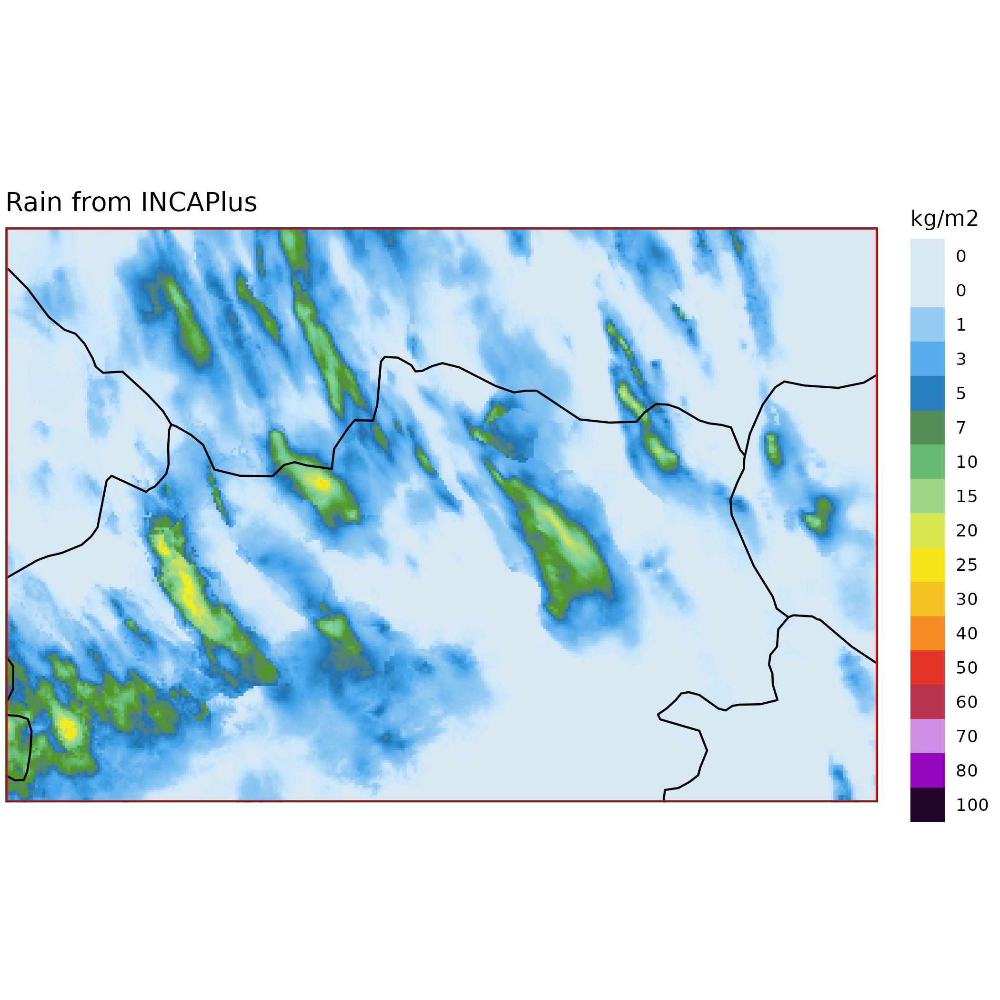
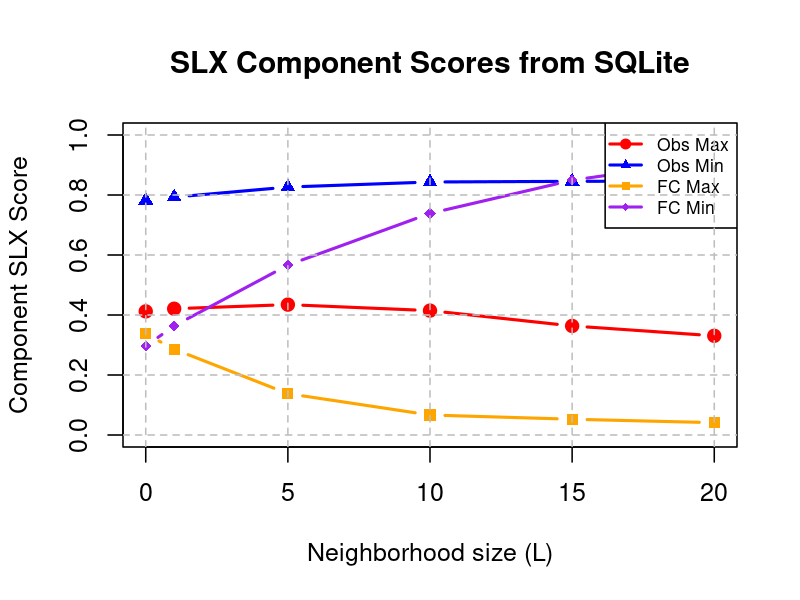
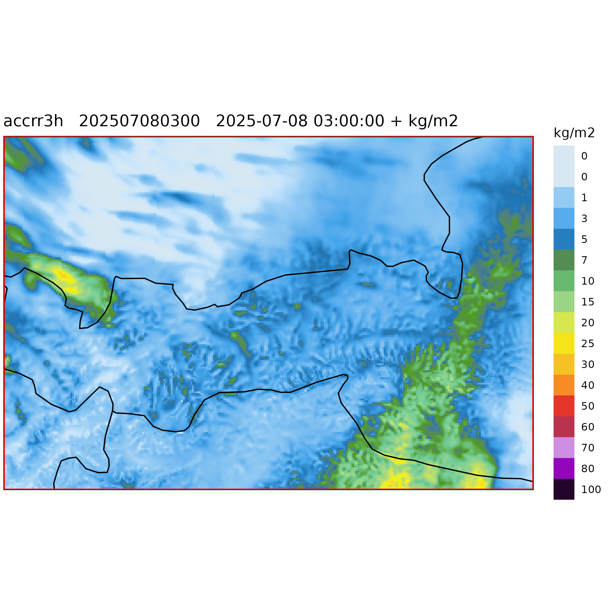
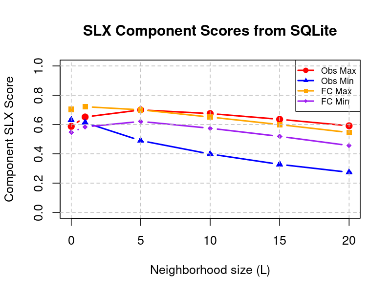

## Convection case on 2025072815, 3h precipitation accumulation

<strong>CLAEF 1k Accumulated Rainfall</strong> 

<strong>INCAPlus Rainfall</strong> 

<strong>Overall SLX Score vs Neighborhood Size</strong> 

<strong>SLX Component Scores vs Neighborhood Size </strong> 

## Orographic case 2025070800, 3h precipitation accumulation

<strong>CLAEF 1k Accumulated Rainfall</strong> 

<strong>INCAPlus Rainfall</strong> 

<strong>Overall SLX Score vs Neighborhood Size</strong> 

<strong>SLX Component Scores vs Neighborhood Size </strong> 

